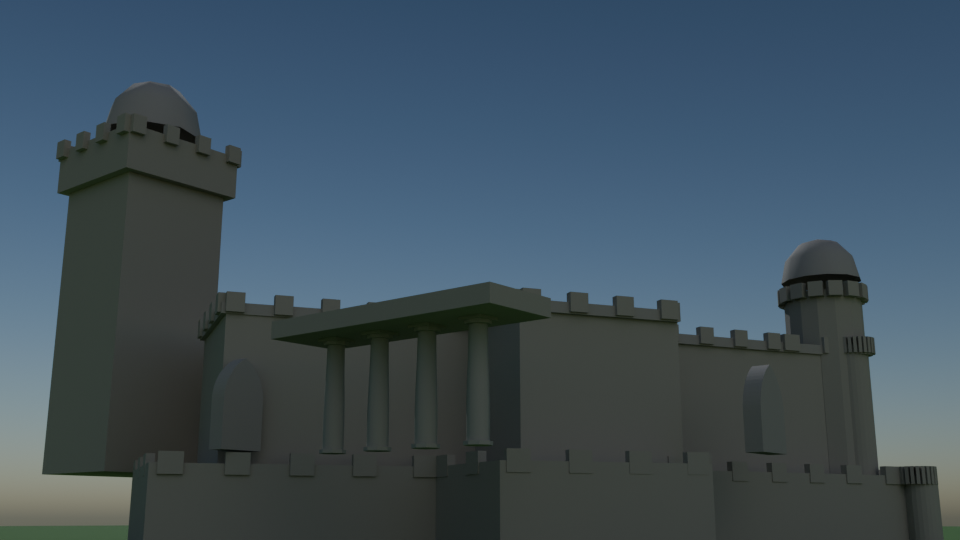
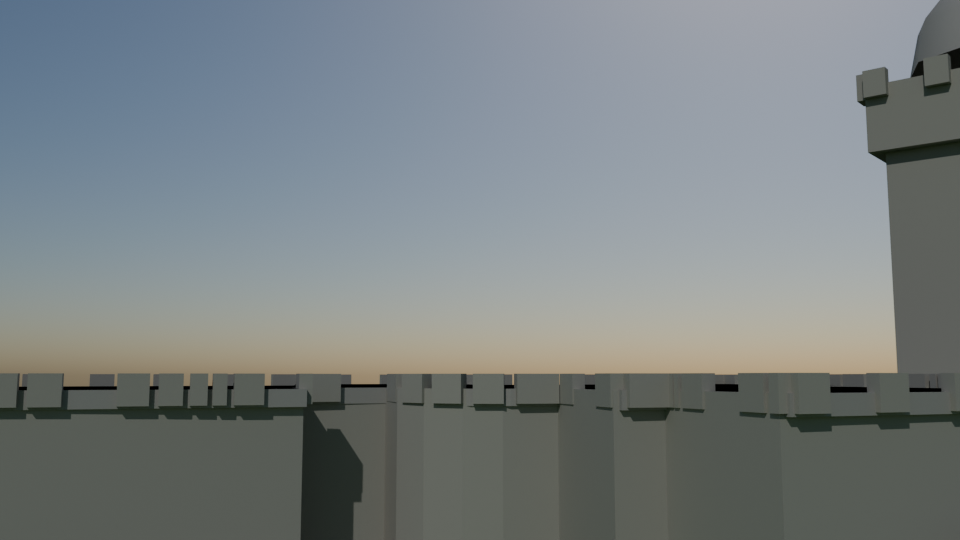

# Belvedere Castle

Script: `blender/landmarks/b_belvedere_castle.py` · agent B · generated 2026-09-07 00:55 UTC

## Published dimensions

* A Gothic/Romanesque Revival folly of **Manhattan schist quarried on site** with **grey granite trim**, built at
  half the scale Vaux originally drew.  The square **tower** rises about **9 m above the terrace** and the whole
  castle stands on **Vista Rock, 30 m above the Turtle Pond** — the highest natural point in the park after
  Summit Rock [Central Park Conservancy, NYC Parks].
* The real OTI footprint (BIN **1083837**, "Belvedere Castle Visitor Center") is **906 m2** with a LiDAR height of
  **7.6 m** over ground **42.7 m NAVD88**; the OSM way ``278363023`` (``historic=castle``) is 13 x 17 m and is
  tagged **height 7.8 m**.  No published overall height was found: the tower is modelled at **16.5 m** above the
  terrace (LiDAR main-roof height 7.6 m plus a 9 m tower), *inferred* and stated.
* Features modelled from photographs: the square crenellated tower with its open **belvedere** stage and conical
  cap, the round turret at the south-west corner, the open loggia over the Turtle Pond, the crenellated terrace
  parapet, and the pointed-arch openings.

## Placement

the real OTI footprint of BIN 1083837, LiDAR ground 42.7 m NAVD88, cross-checked against OSM way
278363023.

## Not modelled

the interior (the Henry Luce Nature Observatory), the weather instruments on the tower, the individual
schist courses, the pavilion's timber roof structure, and Vista Rock's outcrop and the Turtle Pond.

## Polycounts / outputs

* `blender_out/landmarks/b_belvedere_castle.glb` — 4,456 triangles, 0.24 MB, bounds min ['-20.6', '-19.9', '-4.0'] max ['21.2', '21.6', '23.8']
* `blender_out/landmarks/b_belvedere_castle_lod1.glb` — 1,808 triangles, 0.10 MB, bounds min ['-19.8', '-19.9', '-4.0'] max ['21.2', '21.7', '23.8']

## Verification renders (Cycles CPU, 64 spp)

