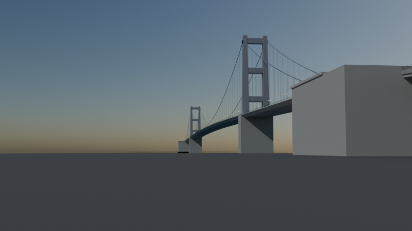
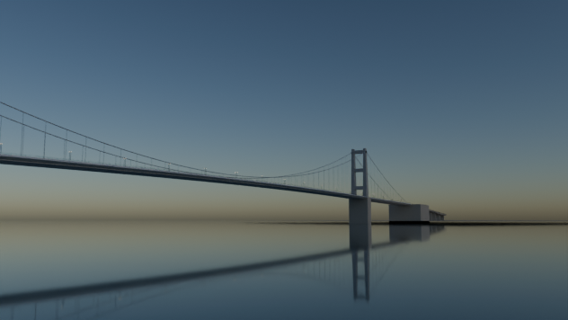
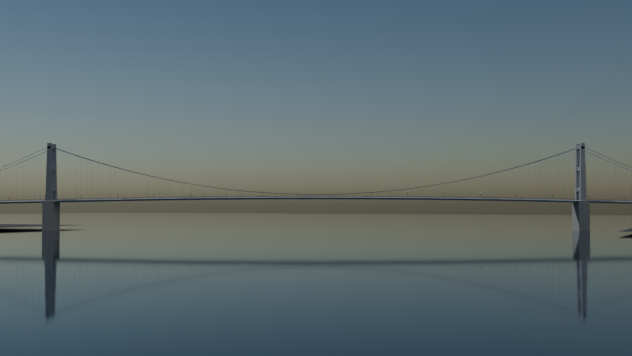

# Bronx-Whitestone Bridge

Script: `blender/landmarks/b_bronx_whitestone.py` · agent B · generated 2026-09-06 15:17 UTC

## Placement

axis heading 153.89 deg (compass, +s), origin NYC_TM (10147.46, 11339.56); alignment source: roads segments.parquet centreline (27 vertices, 0.01 deg from the OSM support axis) + osm supports + published span
measured span between tower_bx and tower_qn: 701.15 m vs published 701.04 m (+0.02 %); towers snapped symmetrically to the published value

| support | kind | NYC_TM x | NYC_TM y | s (m) | t (m) | source |
|---|---|---|---|---|---|---|
| tower_bx | pylon | 9993.2 | 11654.4 | -350.5 | +0.0 | osm_way/1016686393 |
| tower_qn | pylon | 10301.7 | 11024.8 | +350.5 | +0.0 | osm_way/1016686394 |
| anchorage_bx | anchorage | 9891.6 | 11863.7 | -583.2 | +0.8 | osm_way/1016686391 |
| anchorage_qn | anchorage | 10405.0 | 10815.0 | +584.3 | +0.5 | osm_way/1016686396 |

## Published dimensions

* Main span 2,300 ft = **701.04 m**; side spans 735 ft = **224.03 m** each; total length 3,770 ft = **1,149 m**; deck
  width between the cables 74 ft = **22.56 m**; towers **114.9 m** above mean high water (377 ft); clearance below
  134 ft 10 in = **41.10 m**; **6 lanes**; each cable 3,965 ft long with 9,862 wires in 37 strands of 266 wires
  0.196 in (5.0 mm) thick [Wikipedia "Bronx-Whitestone Bridge", MTA Bridges & Tunnels].
* Structural history, all three states published: the 1939 deck was a plate girder 11 ft deep (the Art Deco
  "streamlined" original); 14 ft = 4.27 m stiffening trusses were added in the 1940s after Tacoma Narrows and the
  walkways removed to make six lanes (1947); in 2003-2005 those trusses were removed again and replaced by
  **triangular fibreglass fairings** along both sides of the deck, cutting the suspended mass by ~6,000 tons.
  **This model builds the current (post-2005) state**: plate-girder deck with the triangular fairings.
* Two main cables at t = +-11.28 m (the published 74 ft between cables); Art Deco steel towers with the deep
  horizontal struts of Ammann's 1930s vocabulary.

## Not modelled

the cable bands and wrapping, the toll gantry, the Hutchinson River Parkway and Whitestone Expressway
interchanges, the 1939 World's Fair-era lamp standards (replaced), and the aerodynamic tuned mass dampers.

## Polycounts / outputs

* `blender_out/landmarks/b_bronx_whitestone.glb` — 44,680 triangles, 2.01 MB, bounds min ['-390.4', '-781.4', '-14.0'] max ['390.4', '781.4', '115.6']

## Verification renders (Cycles CPU, 64 spp)

