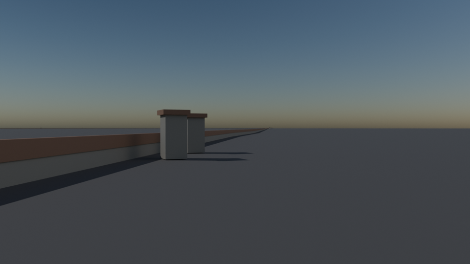
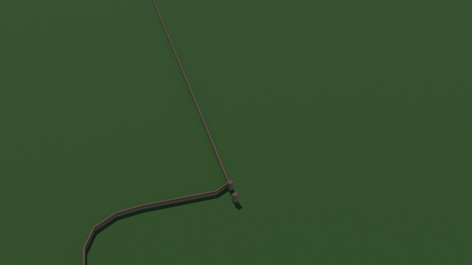

# Central Park perimeter wall and gates

Script: `blender/landmarks/b_central_park_walls_gates.py` · agent B · generated 2026-09-07 00:56 UTC

## Published dimensions

* The park is **843 acres = 3.41 km2**, 2.5 miles by 0.5 miles (**4.0 km x 0.8 km**), bounded by 59th Street,
  Fifth Avenue, 110th Street and Central Park West; its perimeter is **6 miles = 9.66 km** [NYC Parks, Central Park
  Conservancy].  The real OSM boundary polygon used here measures **3,415,832 m2** and **9.69 km** of perimeter —
  0.2 % and 0.3 % from the published figures.
* The perimeter wall is **Manhattan schist with brownstone coping**, about **4 ft = 1.22 m** high and
  **1 ft 6 in = 0.46 m** thick, stepping with the sidewalk grade [NYC Parks].  Heights and thickness are the
  published nominal values; the wall's real course-by-course variation is not reproduced.
* **Twenty named gates** were designated in 1862 (only their names, cut into the coping blocks, mark most of them):
  Scholars', Children's, Inventors', Miners', Engineers', Woodman's, Girls' and Pioneers' on Fifth Avenue;
  Merchants', Women's, Naturalists', Hunters', Mariners', Gate of All Saints, Boys', Strangers' and Warriors' on
  Central Park West; Artisans' and Artists' on Central Park South; and Farmers' on Central Park North.
  Each is modelled as a **pair of schist piers with brownstone caps** flanking the opening; the **name is carried by
  the object name and the catalog entry**, not cut into the stone (stated gap).

## Placement

the wall follows the **real OSM Central Park boundary** (way ``427818536`` in
``data/processed/osm/landuse_leisure.parquet``, 215 vertices), resampled to 9 m.  Each gate's position is computed
from the Manhattan street grid along the park's oriented bounding box: on the avenues, at the fraction
``(street - 59) / 51`` of the edge from the southern corner (the park runs from 59th to 110th Street); on the two
cross-street edges, at the published avenue positions.  Gate positions are therefore **derived from the grid,
+-25 m**, not surveyed.

## Not modelled

the wall's coursing and the cut gate-name lettering, the cast-iron park benches and lamp standards
along it, the ornamental gates at Merchants' and Engineers' Gates, the sidewalk and its trees, and the interior of
the park.

## Polycounts / outputs

* `blender_out/landmarks/b_central_park_walls_gates.glb` — 18,448 triangles, 0.64 MB, bounds min ['-1468.4', '-2122.1', '-0.6'] max ['1330.6', '1858.0', '2.9']
* `blender_out/landmarks/b_central_park_walls_gates_lod1.glb` — 6,800 triangles, 0.27 MB, bounds min ['-1468.4', '-2118.5', '-0.6'] max ['1330.6', '1858.0', '2.9']

## Verification renders (Cycles CPU, 64 spp)

