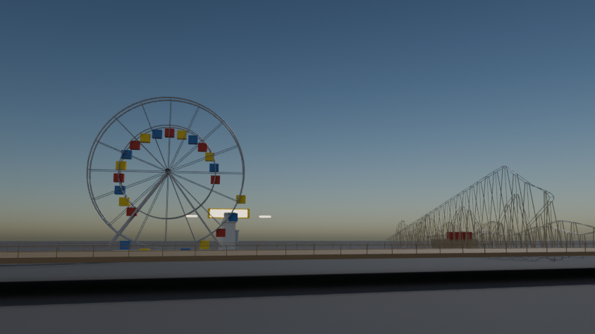
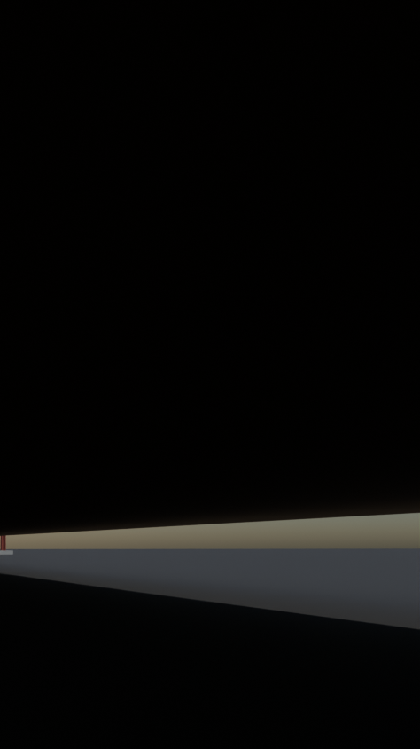
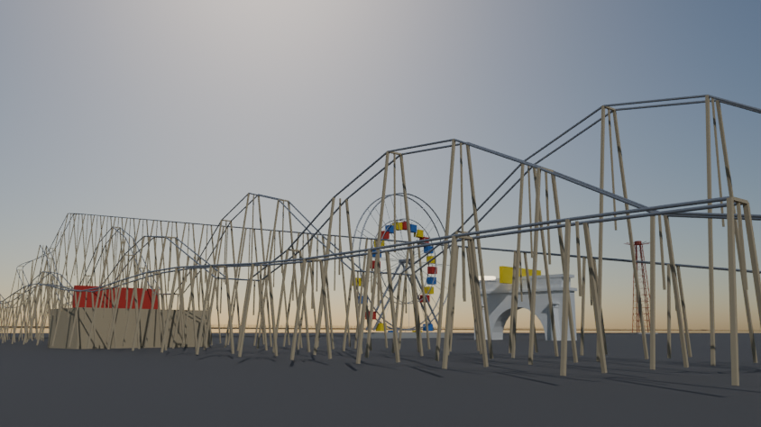

# Coney Island: Cyclone, Wonder Wheel, Parachute Jump and Boardwalk

Script: `blender/landmarks/b_coney_island.py` · agent B · generated 2026-09-06 16:00 UTC

## Published dimensions

* **Cyclone** (Vernon Keenan, opened 26 June 1927): a wooden out-and-back coaster **85 ft = 25.91 m** high with a
  first drop of **85 ft at 58.1 degrees**, **2,640 ft = 804.67 m** of track, a top speed of 60 mph, **12 drops** and
  **6 turns**; NYC Landmark **LP-1636** and NHL 1991 [NYC Parks, LPC, Wikipedia "Cyclone (roller coaster)"].
* **Deno's Wonder Wheel** (Charles Herman, opened 1920): **150 ft = 45.72 m** high, **24 cars** — **16 that swing
  along inner rails** and **8 fixed to the outer rim** — carrying 144 riders, built of 200 tons of Bethlehem steel;
  NYC Landmark **LP-1708** [NYC Parks, LPC].  OSM node ``4080306783`` tags its height as **46 m**.
* **Parachute Jump** (1939 New York World's Fair, moved to Steeplechase Park in 1941, closed 1968): **262 ft =
  79.86 m** high, a six-legged steel lattice tower with **12 cantilevered arms** at the top; NYC Landmark LP-1978.
  OSM way ``248474742`` tags its height as **80 m**.
* **Riegelmann Boardwalk** (1923): **2.7 miles = 4.35 km** long and **80 ft = 24.38 m** wide.  The real OSM way
  ``230060363`` traces **2,600 m** of it, which is what is built (stated gap).
* **Luna Park entrance** (2010): the arched entrance on Surf Avenue with its illuminated crescent-moon sign;
  modelled as a 17 m arch with an emissive sign band (proportions *inferred* from photographs).

## Placement

the Wonder Wheel on OSM node ``4080306783`` (-2468, -13987); the Parachute Jump on OSM way ``248474742``
(-2913, -14105); the boardwalk on OSM way ``230060363``; the Cyclone inside the real plot of OSM ways ``405891521``
/ ``376073239`` / ``656566282`` (union bounding box 39 x 171 m, which matches the published 500 x 85 ft lot); the
Luna Park entrance at Surf Avenue and West 10th Street (-2448, -13930), **derived from the street grid, +-30 m**.
The Cyclone and Wonder Wheel BINs in ``landmark_footprints.parquet`` (3326898/3326899/3423906/3425344 and
3326896/3347224/3326897) confirm those positions.

## Cyclone track honesty statement

The three OSM ways trace only parts of the circuit
(387 / 305 / 255 m of the published 2,640 ft).  The model lays out a folded out-and-back circuit inside the ride's
real plot to the **published 804.67 m of track, 25.91 m lift height and 58.1-degree first drop**, with the published
12 drops; the sequence of curves is therefore a reconstruction to the published parameters, not the real layout.

## Not modelled

the Cyclone's station, chain lift and trains; the Wonder Wheel's car glazing and its ticket booth;
the Parachute Jump's parachutes and their guy cables (the ride has not operated since 1968 and none are on it
today); Nathan's Famous, the Thunderbolt and the other Luna Park rides; the beach and the sand; the boardwalk's
lamp standards and benches.

## Polycounts / outputs

* `blender_out/landmarks/b_coney_island.glb` — 37,308 triangles, 1.81 MB, bounds min ['-1689.2', '-329.7', '-2.0'] max ['878.1', '121.1', '83.1']

## Verification renders (Cycles CPU, 64 spp)

