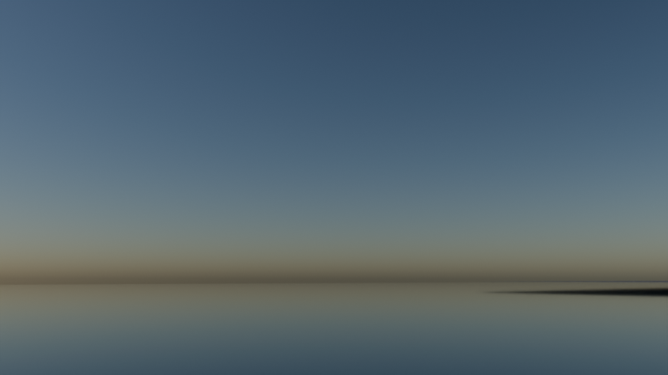
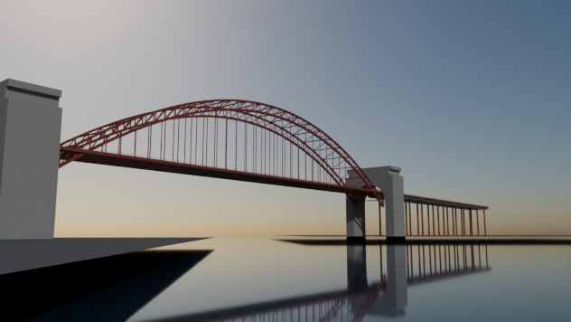
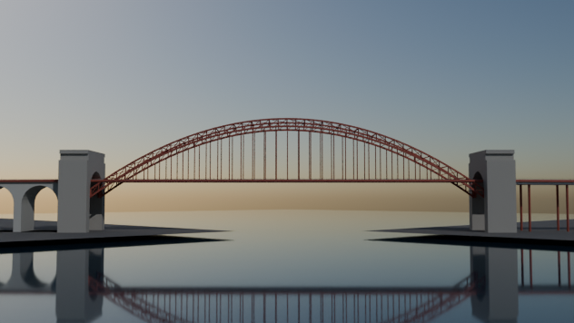

# Hell Gate Bridge

Script: `blender/landmarks/b_hell_gate.py` · agent B · generated 2026-09-06 15:20 UTC

## Placement

axis heading 314.66 deg (compass, +s), origin NYC_TM (2363.90, 9167.31); alignment source: osm bridge:support ways + published span
measured span between tower_qn and tower_wi: 329.47 m vs published 329.47 m (-0.00 %); towers snapped symmetrically to the published value

| support | kind | NYC_TM x | NYC_TM y | s (m) | t (m) | source |
|---|---|---|---|---|---|---|
| tower_qn | pylon | 2481.1 | 9051.5 | -164.7 | +0.0 | osm_way/1016643614 |
| tower_wi | pylon | 2246.7 | 9283.1 | +164.7 | +0.0 | osm_way/1016643613 |

## Published dimensions

* Steel **through arch**: **1,017 ft = 310.0 m between the outer faces**, 977.5 ft = **297.94 m clear** between the
  inner faces; width 100 ft = **30.48 m**; clearance below **135 ft = 41.15 m**; the deck reaches **145 ft = 44.20 m**
  above mean high water at the centre; the arch crown stands **305 ft = 92.96 m** above mean high water
  [Wikipedia "Hell Gate Bridge"].
* Masonry towers at each end of the arch: **220 ft = 67.06 m** high, concrete clad with Maine granite above ground.
  They are purely architectural — the arch carries no load into them.
* Tracks: **4** originally, **3** in service today (2 Amtrak Northeast Corridor + 1 New York & Atlantic freight);
  standard gauge 1.435 m.  This model lays all four track beds and rails the three in service.
* Approach viaducts: Wards Island ~2,650 ft = 810 m and Randalls Island ~1,965 ft = 599 m to the north-west, plus the
  Astoria approach to the south-east; total structure with approaches 17,000 ft = 5.2 km.
* Colour: the "Hell Gate red" applied in the 1990s.

## Not modelled

the Little Hell Gate and Bronx Kill spans (they belong to the same railway but are separate structures),
the catenary masts and overhead wire, the signal bridges, the Hornbostel cornice detail on the towers, the rivet and
gusset plates, and the ballast and sleepers (a continuous bed is used instead).

## Polycounts / outputs

* `blender_out/landmarks/b_hell_gate.glb` — 23,788 triangles, 1.09 MB, bounds min ['-341.3', '-281.3', '-6.0'] max ['284.4', '337.5', '93.7']

## Verification renders (Cycles CPU, 64 spp)

