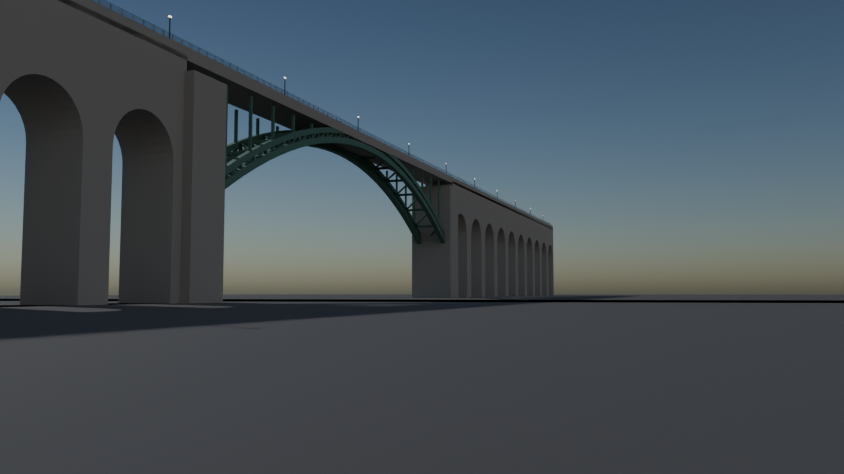
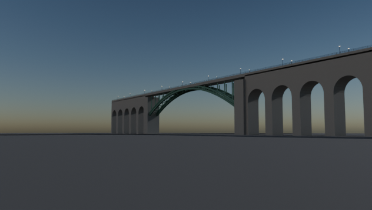
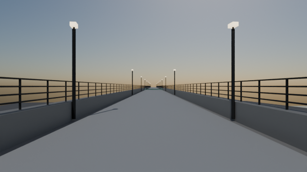

# High Bridge

Script: `blender/landmarks/b_high_bridge.py` · agent B · generated 2026-09-06 15:23 UTC

## Placement

origin NYC_TM (1737.0, 15797.4), heading 97.18 deg, from the end vertices of OSM way 60251530 (measured 344.1 m, published length 442.0 m built symmetrically about the midpoint).

## Published dimensions

* Length **1,450 ft = 442.0 m**; the deck stands **138 ft = 42.06 m** above the Harlem River [NYC Parks, HAER
  NY-127, Wikipedia "High Bridge (New York City)"].
* Originally **15 masonry arches** — five of 80 ft (24.4 m) over the river channel and ten of 50 ft (15.24 m) over
  land.  In **1927-28 the five river arches were removed** and replaced by a single **steel arch of 450 ft =
  137.16 m** to widen the navigation channel; the ten land arches survive.  The model builds that post-1928 state.
* It carried two 90-inch (2.29 m) Croton Aqueduct pipes under a promenade; it reopened as a pedestrian and cycle
  bridge in June 2015.
* Deck width: **7.3 m** — *inferred* (+-1 m) from the OSM bridge polygon and photographs; no published width was found.

## Not modelled

the two aqueduct pipes inside the deck, the granite coursing, the 1864-vintage cast-iron railing
pattern, the Highbridge Water Tower (a separate landmark 200 m to the east), the 2015 reconstruction's lighting, and
the stairs and ramps at either end.

## Polycounts / outputs

* `blender_out/landmarks/b_high_bridge.glb` — 15,112 triangles, 0.76 MB, bounds min ['-219.9', '-32.4', '-1.0'] max ['219.9', '32.4', '47.8']

## Verification renders (Cycles CPU, 64 spp)

