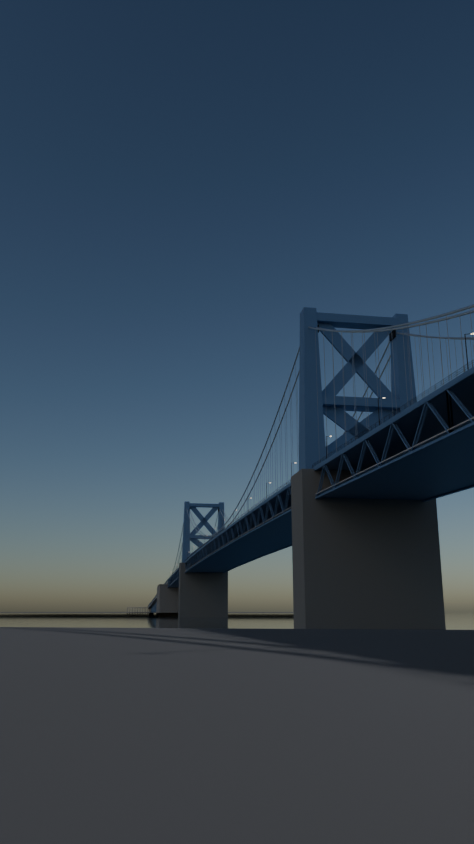
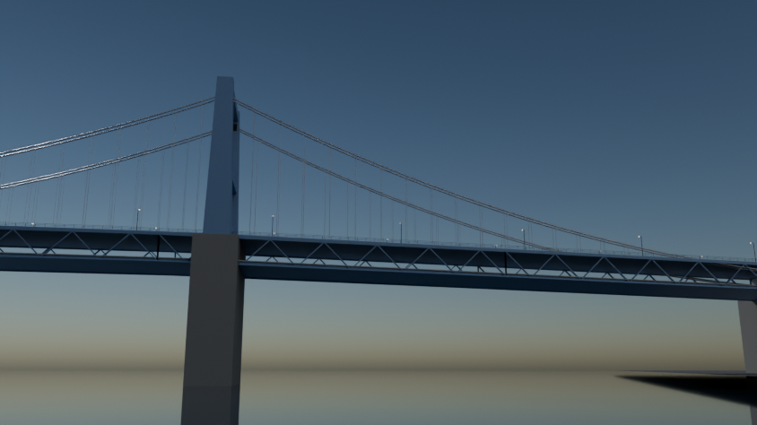
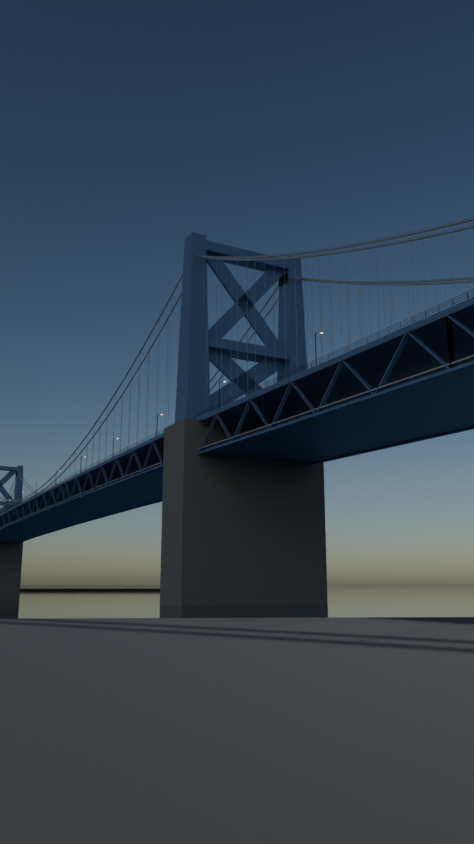

# Manhattan Bridge

Script: `blender/landmarks/b_manhattan_bridge.py` · agent B · generated 2026-09-06 14:56 UTC

## Placement

axis heading 337.12 deg (compass, +s), origin NYC_TM (-3419.30, 774.08); alignment source: osm bridge:support ways + published span
measured span between tower_bk and tower_mn: 445.63 m vs published 451.10 m (-1.21 %); towers snapped symmetrically to the published value

| support | kind | NYC_TM x | NYC_TM y | s (m) | t (m) | source |
|---|---|---|---|---|---|---|
| tower_bk | pylon | -3332.7 | 568.8 | -225.6 | +0.0 | osm_way/317352033 |
| tower_mn | pylon | -3505.9 | 979.4 | +225.6 | +0.0 | osm_way/1255353996 |
| anchorage_bk | anchorage | -3234.4 | 338.7 | -473.0 | -1.0 | osm_way/1255353998 |
| anchorage_mn | anchorage | -3603.6 | 1209.8 | +473.0 | +0.4 | osm_way/1017507380 |

## Published dimensions

* Main span 1,480 ft = **451.1 m**; side spans 725 ft = **221.0 m** each; total length 6,855 ft = **2,089 m**; deck
  width 120 ft = **36.58 m**; clearance 135 ft = **41.15 m** above mean high water; towers 350 ft = **106.68 m** to
  the ornamental finials; anchorages 237 x 182 ft x 135 ft = **72.24 x 55.47 x 41.15 m**
  [Wikipedia "Manhattan Bridge", NYCDOT East River bridges].
* Decks [Wikipedia]: **upper level** two separate roadways of 2 lanes each at the outer edges (east roadway 24 ft,
  west roadway 22.5 ft); **lower level** 3 vehicle lanes in the centre, **4 subway tracks** (a pair under each upper
  roadway — B/D on the north side, N/Q on the south), a 10-12 ft walkway on the south side and a 10-12 ft bicycle path
  on the north side.  Standard gauge 1.435 m.
* Cables: four main cables, two passing over each tower leg (**inferred** pairing from photographs, +-0.4 m on the
  plane offsets); 21 in = 0.533 m diameter.
* Manhattan approach: the 1912 Carrere & Hastings triumphal arch at Canal Street and the flanking semicircular Tuscan
  colonnade (LP-1240).
* Colour: the "Manhattan Bridge blue" of the current paint scheme.

## Verification renders

Three verification renders, each framed to answer one question.

    1. ``dumbo_washington_street`` — **the real photographic viewpoint**, taken from
       ``docs/verification/reference/dumbo_washington_st_manhattan_bridge/meta.json``: camera 40.70330 N,
       73.98958 W (Washington Street between Front and Water), azimuth 355.6 deg, subject the Manhattan Bridge's
       Brooklyn tower 134 m away; rendered in portrait like the four Commons photographs the reference records.
       Question: at the real camera position, distance and bearing, is the tower the right size and shape?
       *The brick warehouse walls that frame the tower in the photographs belong to the buildings stage and are
       not in this model, so the render shows the bridge alone against the sky.*
    2. ``tower_three_quarter`` — the Brooklyn tower from the river with the sun 35 deg up and off-axis.
       Question: are the portal legs, the four horizontal struts, the finials and the two deck levels right?
    3. ``elevation_both_towers`` — a long lens with both towers, the 451.1 m main span and both anchorages in
       frame.  Question: is the span, the cable sag and the two-level deck right?

## Not modelled

the cable bands and wrapping, the subway third rail and signals, the 2001-2004 reconstruction's steel
plate reinforcement, the tower finial castings in detail, the arch's sculptural groups ("Spirit of Commerce" and
"Spirit of Industry") and frieze, and the Brooklyn-side pedestrian ramps.

## Polycounts / outputs

* `blender_out/landmarks/b_manhattan_bridge.glb` — 80,700 triangles, 3.33 MB, bounds min ['-479.3', '-830.7', '-10.0'] max ['375.3', '999.4', '107.4']

## Verification renders (Cycles CPU, 64 spp)

