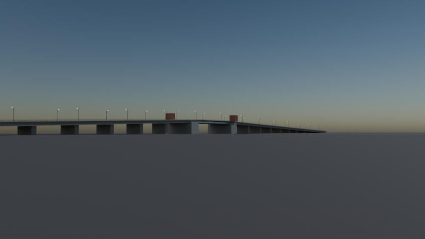
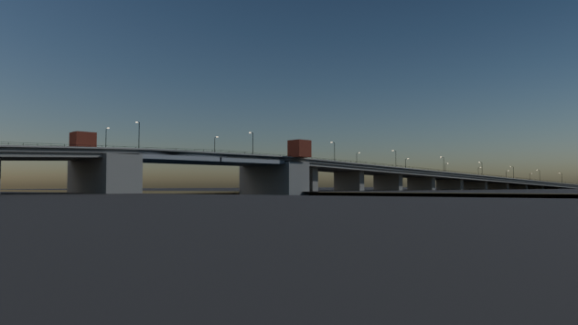
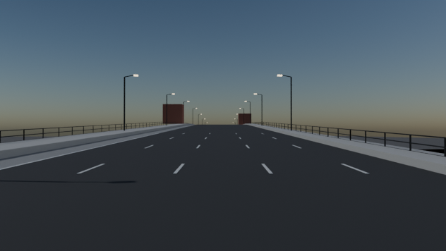

# Pulaski Bridge

Script: `blender/landmarks/b_pulaski.py` · agent B · generated 2026-09-06 15:26 UTC

## Placement

axis heading 10.78 deg (compass, +s), origin NYC_TM (-223.01, 4357.57); alignment source: roads segments.parquet centreline (16 vertices, 3.43 deg from the OSM support axis) + osm supports + published span
measured span between pier_bk and pier_qn: 52.62 m vs published 53.95 m (-2.46 %); towers snapped symmetrically to the published value

| support | kind | NYC_TM x | NYC_TM y | s (m) | t (m) | source |
|---|---|---|---|---|---|---|
| pier_bk | pier | -227.9 | 4331.7 | -27.0 | +0.0 | osm_way/1054539113 |
| pier_qn | pier | -218.1 | 4383.4 | +27.0 | +0.0 | osm_way/992001660 |

## Published dimensions

* Total length 2,810 ft = **856.5 m**; longest span 177 ft = **53.95 m**; clearance below 39 ft = **11.89 m**;
  **four-leaf bascule** movable span; steel superstructure on reinforced-concrete approaches; five motor-vehicle
  lanes plus pedestrian and bicycle paths (the northbound-side lane became a two-way protected bike lane in 2016)
  [Wikipedia "Pulaski Bridge", NYCDOT].
* Deck width **24.0 m** — *inferred* (+-1.5 m) from the lane count (5 x 3.35 m), the 3.6 m bike lane, a 2.4 m
  sidewalk and parapets; no published width was found.
* Approaches: long concrete viaducts on both sides, carrying the roadway from grade up to the bascule level.

## Not modelled

the operator's house interior, the counterweight pits and machinery, the trunnion bearings, the traffic
gates and warning signals, and the 2016 bike-lane barrier detail.

## Polycounts / outputs

* `blender_out/landmarks/b_pulaski.glb` — 14,592 triangles, 0.71 MB, bounds min ['-91.9', '-320.1', '-3.0'] max ['92.5', '319.9', '22.8']

## Verification renders (Cycles CPU, 64 spp)

