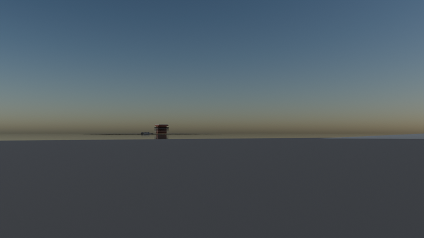
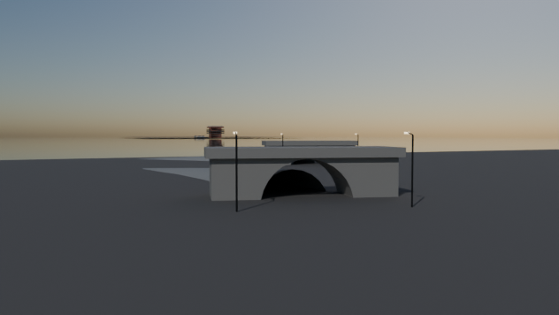
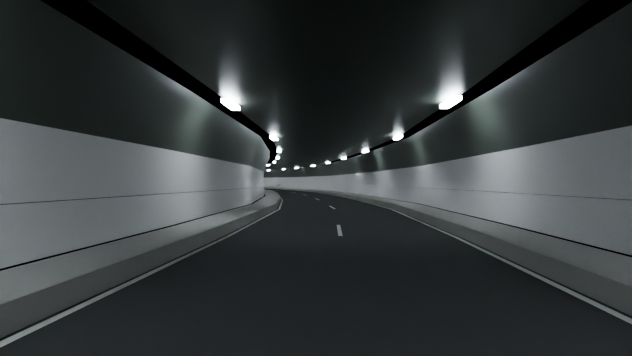

# Queens-Midtown Tunnel

Script: `blender/landmarks/b_queens_midtown_portals.py` · agent B · generated 2026-09-06 15:42 UTC

## Placement

frame origin NYC_TM (-1134.0, 4849.0); both bores on real OSM centrelines; both ventilation buildings on their real OSM footprints.

## Published dimensions

* **Northern tube 6,414 ft = 1,955.0 m** (the length named in the build brief), **southern tube 6,272 ft =
  1,911.7 m**; exterior tube diameter 31 ft = **9.45 m**; roadway width 21 ft = **6.40 m**, two lanes per tube
  (**4 lanes** in all); vertical clearance 12 ft 1 in = **3.68 m** [Wikipedia "Queens-Midtown Tunnel", MTA B&T].
* **Two ventilation buildings**, one on each side of the East River: the Manhattan one is octagonal, between 41st and
  42nd Streets at First Avenue; the Queens one is a rectangular tower in the middle of Borden Avenue between Second
  and Fifth Streets.  Both are real OSM buildings with tagged heights — ``265517923`` (Manhattan, 33.3 m) and
  ``280623192`` (Queens, 27.8 m) — and their real polygon footprints are used.
* Interior: white glazed tile to 2.4 m, raised catwalk each side, a **luminaire every 10 m** in each ceiling cove and
  a recessed emergency door every 150 m, alternating sides.
* The low point of the roadway is **not published**; it is modelled 27.0 m below mean high water (*inferred*, +-4 m),
  which is consistent with the tunnel's published 6,414 ft length, its portal elevations and a maximum grade of 4 %.

Placement: both tube centrelines are real OSM ``highway=motorway, tunnel=yes, name=Queens-Midtown Tunnel`` ways —
northern ``11878036`` + ``706015228``, southern ``813727586`` + ``658498546``.  Each chained centreline is trimmed or
extended symmetrically along its end tangents to its published length; the measured-versus-published difference for
each bore is logged and recorded in the catalog entry under ``tube_stats``.  ``segments.parquet`` was not available.

## Not modelled

the fan rooms and dampers inside the two ventilation buildings, the octagonal Manhattan building's
faceting above the roof line, the Manhattan and Queens toll-plaza and approach ramps, the lane-control signals and
jet fans, and the individual tile courses.

## Polycounts / outputs

* `blender_out/landmarks/b_queens_midtown_portals.glb` — 30,888 triangles, 1.44 MB, bounds min ['-850.0', '-265.0', '-23.6'] max ['821.1', '504.1', '41.7']

## Verification renders (Cycles CPU, 64 spp)

