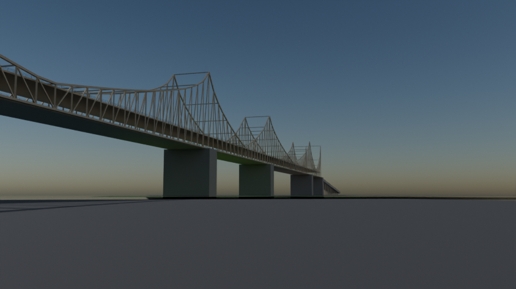
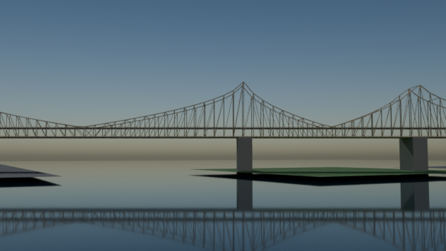
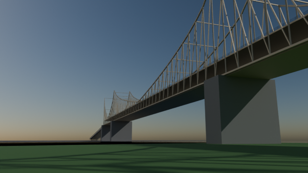

# Ed Koch Queensboro Bridge

Script: `blender/landmarks/b_queensboro_bridge.py` · agent B · generated 2026-09-06 15:02 UTC

## Placement

axis heading 119.77 deg (compass, +s), origin NYC_TM (-374.47, 6311.83); alignment source: osm bridge:support ways + published span
measured span between pier2 and pier3: 191.22 m vs published 192.00 m (-0.41 %); towers snapped symmetrically to the published value

| support | kind | NYC_TM x | NYC_TM y | s (m) | t (m) | source |
|---|---|---|---|---|---|---|
| abut_mn | abutment | -894.2 | 6609.1 | -598.7 | -0.1 | osm_way/1016487161 |
| pier1 | pier | -770.9 | 6538.2 | -456.6 | -0.4 | osm_way/1016487159 |
| pier2 | pier | -457.4 | 6359.4 | -96.0 | +0.0 | osm_way/1016487155 |
| pier3 | pier | -291.5 | 6264.2 | +96.0 | +0.0 | osm_way/1016487154 |
| pier4 | pier | -30.1 | 6115.7 | +396.3 | +0.7 | osm_way/1016487157 |
| abut_qn | abutment | 90.7 | 6045.6 | +536.0 | -0.1 | osm_way/1016487170 |

## Published dimensions

* **Double-decked cantilever bridge**, five steel spans, measured Manhattan to Queens [Wikipedia "Queensboro Bridge"]:

  | span | published | modelled | measured between the OSM pier centroids |
  |---|---|---|---|
  | 1 York Avenue | 469.5 ft = 143.1 m | 143.1 m | 141.3 m |
  | 2 East River west channel | 1,182 ft = 360.3 m | 360.3 m | 360.9 m |
  | 3 over Roosevelt Island | 630 ft = 192.0 m | 192.0 m | 191.2 m |
  | 4 East River east channel | 984 ft = 300.0 m | 300.0 m | 300.7 m |
  | 5 Vernon Boulevard | 459 ft = 139.9 m | 139.9 m | 139.2 m |

  Total steel length 1,135.3 m; total length with approaches 7,449 ft = 2,270 m; deck width 100 ft = **30.48 m**;
  overall height 350 ft = **106.68 m**; clearance below 130 ft = **39.62 m**; the truss towers stand 185 ft = **56.4 m**
  above the lower chords; the masonry piers are 100-125 ft (30.5-38.1 m) tall.
* Decks: **upper level 4 lanes** (two roadways of 2), **lower level 4 vehicular lanes** plus the pedestrian/bicycle
  path on the north side.  The lower roadway rides the level bottom chord for the whole length, so the model uses the
  bottom chord as the truss reference line (``top_frac=1.0, bot_frac=0.0``) and lets the top chord rise from 10.5 m
  above it at mid-span to the 106.68 m tower tops over the piers.
* Colour: the current buff/tan paint scheme.

## Not modelled

the Hornbostel terracotta and the Guastavino-vaulted market under the Manhattan approach, the demolished
Roosevelt Island elevator/trolley kiosk, the finials on the pier towers in detail, the rivet and gusset plates, the
1930s-1950s roadway rebuilds, and the Queens Plaza ramp network.

## Polycounts / outputs

* `blender_out/landmarks/b_queensboro_bridge.glb` — 59,736 triangles, 2.97 MB, bounds min ['-876.3', '-475.9', '-8.0'] max ['821.1', '507.3', '107.6']

## Verification renders (Cycles CPU, 64 spp)

