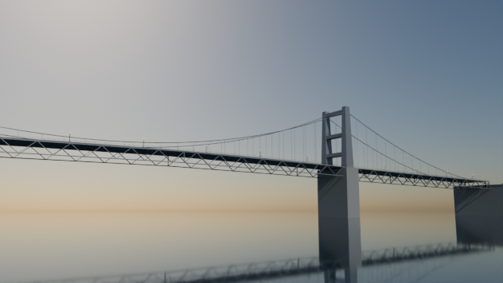
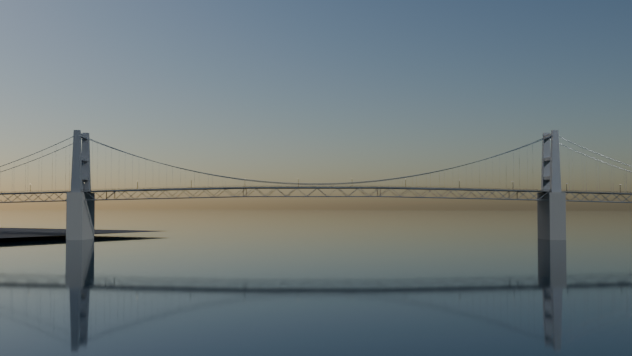

# Robert F. Kennedy (Triborough) Bridge

Script: `blender/landmarks/b_rfk_triborough.py` · agent B · generated 2026-09-06 15:12 UTC

## Placement

axis heading 329.86 deg (compass, +s), origin NYC_TM (1967.31, 8847.50); alignment source: roads segments.parquet centreline (42 vertices, 0.67 deg from the OSM support axis) + osm supports + published span
measured span between sus_tower_qn and sus_tower_wi: 420.60 m vs published 420.62 m (-0.00 %); towers snapped symmetrically to the published value

| support | kind | NYC_TM x | NYC_TM y | s (m) | t (m) | source |
|---|---|---|---|---|---|---|
| sus_tower_qn | pylon | 2072.9 | 8665.6 | -210.3 | +0.0 | osm_way/1016642596 |
| sus_tower_wi | pylon | 1861.7 | 9029.4 | +210.3 | +0.0 | osm_way/1016642595 |

## Published dimensions

* **East River suspension span**: main span 1,380 ft = **420.62 m**; side spans 700 ft = **213.36 m** each; total
  2,780 ft = 847.3 m; deck width 98 ft = **29.87 m**; towers **96.01 m** (315 ft) above mean high water; clearance
  143 ft = **43.59 m**; **8 lanes** (4 each way).
* **Harlem River lift bridge**: movable span 310 ft = **94.49 m**; side spans 195 ft = **59.44 m** each; total 700 ft
  = 213.36 m; width 92 ft = **28.04 m**; towers 210 ft = **64.01 m**; clearance 55 ft = **16.76 m** closed and
  135 ft = **41.15 m** raised; **6 lanes**.  Modelled in the *closed* position.
* **Bronx Kill crossing**: main truss span 383 ft = **116.74 m**; approach spans 1,217 ft = 370.9 m combined; total
  1,600 ft = 487.7 m; clearance 55 ft = **16.76 m**; **8 lanes**.
* **Viaducts**: the structure crossing Randalls and Wards Islands is "more than 2.5 miles (4.0 km)"; the three legs
  modelled here (Wards Island 1.51 km, Bronx Kill leg 0.78 km, Harlem River leg 2.01 km) total **4.30 km** measured
  between the real structures.
* **Toll plaza**: on Randalls Island at the junction of the three legs (OSM ways ``392834791``/``392834793`` cover the
  plaza and its ramps); modelled as an 8-lane gantry-and-island plaza with a canopy.

## Not modelled

the cable bands and wrapping, the lift-span machinery and counterweight ropes in detail, the toll
collection equipment, the Randalls Island ramps and the Bruckner/Grand Central Parkway interchanges, Downing Stadium
and the island parkland, and the pedestrian walkway ramps.

## Polycounts / outputs

* `blender_out/landmarks/b_rfk_triborough.glb` — 80,446 triangles, 3.71 MB, bounds min ['-674.1', '-591.2', '-12.0'] max ['467.7', '3563.4', '96.7']

## Verification renders (Cycles CPU, 64 spp)

