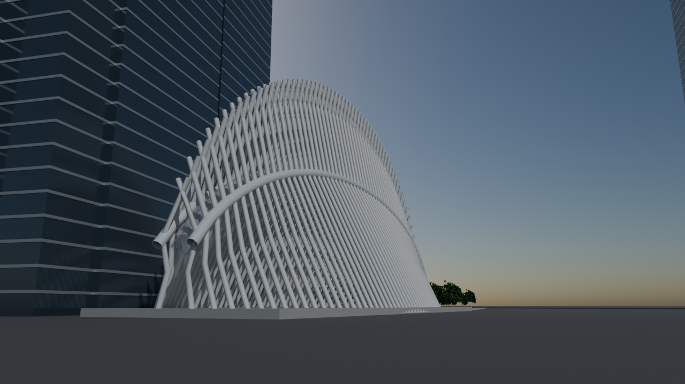
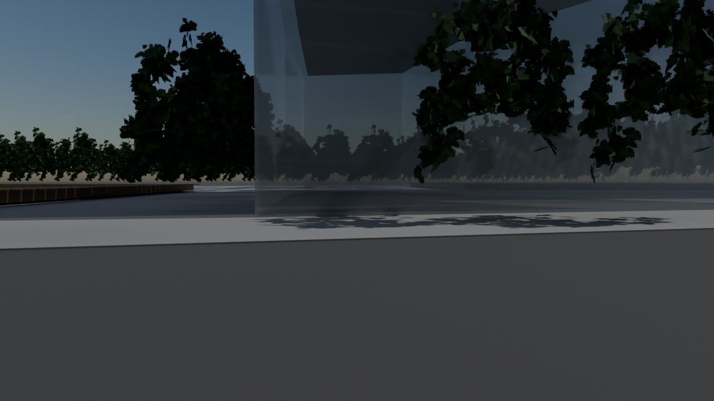
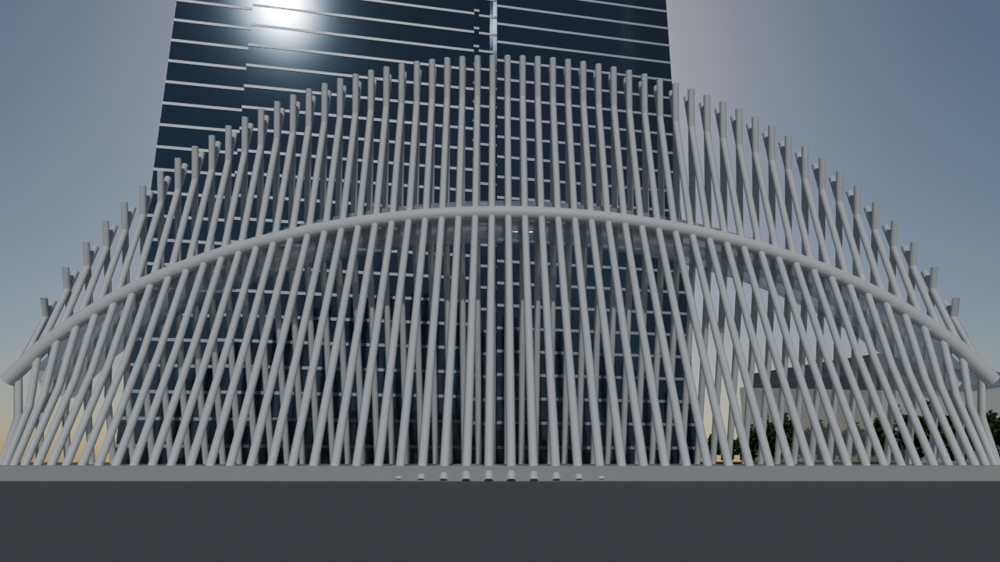
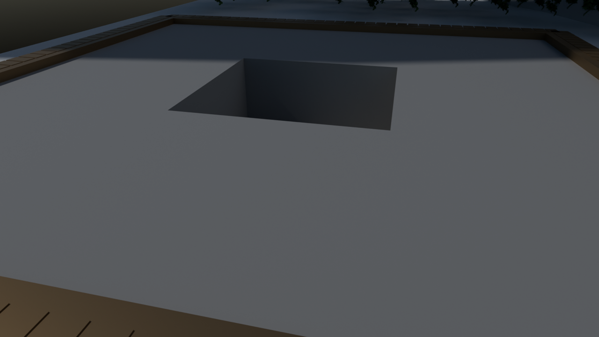
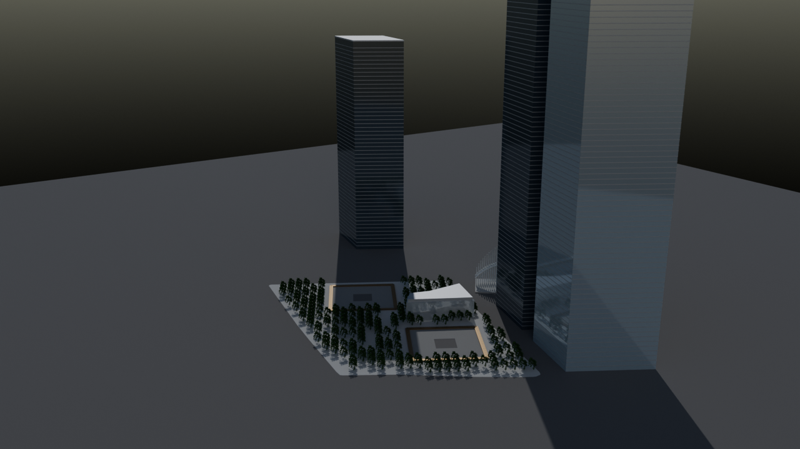

# World Trade Center site

Script: `blender/landmarks/b_wtc_site.py` · agent B · generated 2026-09-07 07:37 UTC

## Placement

frame origin NYC_TM (-5338.0, 1285.0) at 4.40 m NAVD88 -- the plaza's own elevation, with the plaza at 0.0 in model space; every building on its real OTI footprint; pool centres and rotation measured from OSM ways 697722178 / 697722181; plaza outline from OSM way 129835611, cut open over both pools.

## Published dimensions

* **Oculus** (Santiago Calatrava, WTC Transportation Hub, opened 4 March 2016): the arched elliptical body is
  **350 ft = 106.7 m long**, **115 ft = 35.1 m wide** at its widest, and rises **96 ft = 29.3 m above grade at the
  apex**; the structural steel ribs continue upward as a pair of canopies reaching **168 ft = 51.2 m above grade**;
  between the two 350 ft arches a **330 ft = 100.6 m operable skylight** runs the length of the building; the
  concourse is column-free and 11,500 tons of structural steel were used [Calatrava, PANYNJ, explorewtc.com].
  This model builds **2 x 56 = 112 ribs** — the rib count is *inferred* from the published 350 ft length and the
  photographed rib pitch (about 1.9 m), not from a published figure.  The body's **long axis is measured from its
  own footprint** (BIN 1089309) at build time, not assumed: the minimum rotated rectangle of that polygon is
  110.0 x 33.3 m with its long edge on **128.2 deg**, and an area-weighted principal axis of the same polygon gives
  128.8 deg.
* **3 World Trade Center** (Rogers Stirk Harbour, 2018): **329.2 m** (1,079 ft), 80 storeys; **4 World Trade Center**
  (Maki, 2013): **297.7 m** (977 ft), 72 storeys; **7 World Trade Center** (SOM, 2006): **226.1 m** (741.7 ft), 52
  storeys, a parallelogram plan over a Con Edison substation podium.
* **National September 11 Memorial** (Michael Arad / Peter Walker, 2011): **two pools, each set in the 200 ft =
  61.0 m footprint of one of the original towers**, "each pool nearly an acre"; the water falls **9.1 m (30 ft)**
  down the pool walls to a second, smaller void; the names of the **2,983 victims are inscribed on 152 bronze
  parapets** around the pools.  The parapets carry the material slot ``MEMORIAL_NAMES`` so the engine can drive the
  incised-name texture.  The **plaza is cut open over both pools** — a plaza built as one unbroken surface hides
  them from every camera standing on it, which is the one thing the memorial views have to show.
* **Plaza trees**: more than **400 swamp white oaks** (*Quercus bicolor*) and one Callery pear (the Survivor Tree).
  The trees come from the street-props agent's library in ``blender_out/props/``.  That library has no swamp white
  oak, so ``tree_pin_oak_medium`` (*Quercus palustris*, same genus, same upright habit) stands in — **a stated
  species substitution** — collapse-decimated to 520 triangles and instanced, so 220 trees cost one mesh in the glb.
  The Survivor Tree is a Callery pear and uses ``tree_callery_pear_medium``, which is the right species.  The prop
  is 18.4 m tall and is scaled to the 11 m canopy the memorial oaks stand at today.  **220 oaks** are placed, not
  the published 400+: a 7.3 m grid on the pools' own axis, clipped to the plaza deck 4 m in from its edge and clear
  of the two openings and the museum pavilion, leaves 387 standing places, and 220 of them are drawn with a fixed
  seed so the grove covers the whole plaza instead of filling one end of it.  If the props library is absent the
  build falls back to ``b_common.simple_tree`` and the report says so.

## Verification renders

Four verification renders, each framed to answer one question.

    1. ``oculus_church_street_reference`` — the comparison lane's recorded Church Street viewpoint, used verbatim,
       which is where every photograph of the Oculus is taken from.  Because the building's long axis runs
       128.2 deg and Church Street runs 26.3 deg, the street is off the building's **end**, not its side — which
       is why the entrance hall faces it.  Question: does the Oculus present its end to Church Street with the
       ribs sweeping away on both sides, and does it stand clear of 3 WTC?  On the old 160.6 deg it did neither:
       the body lay across the street's line of sight and its south-east end was inside 3 WTC's footprint.
       (There was a second, hand-placed ``oculus_from_church_street`` here.  It was a fixed offset along the
       *perpendicular to the axis*, so on the corrected axis it landed 21 m from the building's south-east tip
       and filled the frame with ribs — and where it did work it was the same shot as this one.  One honest view
       of Church Street rather than two, one of them wrong.)
    2. ``oculus_broadside`` — square on to the long axis at 78 m with a 72 deg lens, which is the narrowest frame
       that contains all 106.7 m of it.  Question: is the ribbed elliptical body 106.7 m long and 35.1 m wide,
       29.3 m to the apex with the canopy rib tips at 51.2 m, do the 112 ribs spring from the two 350 ft arches,
       and does the 100.6 m skylight run between them?
    3. ``memorial_plaza`` — the north pool from 38 m out and 12 m above the plaza, with no context ground plane.
       Question: is the plaza actually cut open over the pool, is the pool the published 61.0 m square with a
       9.14 m fall to the void, and do the bronze name parapets ring the opening?
    4. ``site_aerial`` — the whole superblock.  Question: are 3, 4 and 7 WTC on their real footprints at
       329.2 / 297.7 / 226.1 m, and are the two pools and the plaza oaks in the right places?

## Not modelled

the below-grade PATH platforms, the memorial museum's underground galleries (only the pavilion above
grade is built), 2 World Trade Center (never built above the below-grade box), the Liberty Park elevated garden and
St Nicholas Greek Orthodox Church, the individual curtain-wall panes, and the Oculus's marble interior floor.  The
ground beyond the memorial plaza is the terrain and pavement stages' work, not this model's: the plaza is the real
8-acre memorial plaza and stops there, where it used to be a 520 x 520 m quad reaching a quarter of a kilometre
past the site and standing over Liberty Street and the Hudson River Greenway.

Axes
----
One constant, ``PLAZA_AXIS_DEG = 160.6``, used to orient the Oculus, carry the frame's informational heading and
aim the Oculus verification cameras.  It measured none of those things.  160.6 deg is the heading of the line
between the two *derived* pool centres the earlier build placed at local (-28.23, 80.17) and (28.23, -80.17) — a
figure the pool correction replaced with measured centres whose line runs 176.3 deg — so after that correction
nothing in this model had that axis.  It is now three separate things, each measured:

* ``OCULUS_AXIS_DEG`` — the Oculus's long axis, **taken from BIN 1089309's own footprint at build time** and
  cross-checked against the recorded 128.2 deg.  At 160.6 deg the modelled body stood 32.4 deg off its footprint:
  only 58 % of its plan lay over BIN 1089309 (IoU 0.41), both ends of the 106.7 m body were about 17 m outside that
  footprint, and the south-east end sat **inside 3 WTC's footprint** (231 m2 of the base prism overlapped it).
  On the measured axis 94 % of the body lies over its own footprint (IoU 0.90) and it overlaps neither 3 WTC nor
  4 WTC at all.
* ``SITE_AXIS_DEG`` — the frame's informational ``heading_deg``: the original towers' grid, which is what the
  memorial pools, 3 WTC and 4 WTC all stand on (pool square edges 29.2 deg measured from OSM ways 697722178 /
  697722181; 3 WTC's footprint 26.5 deg, 4 WTC's 29.4 deg).  The memorial plaza polygon has no usable axis of its
  own — its minimum rotated rectangle runs 15.5 deg while its area-weighted principal axis runs 172.0 deg, 23 deg
  apart, because the plaza is not a rectangle.
* the pools keep ``POOL_AXIS_DEG``, measured, which they already did.

## Polycounts / outputs

* `blender_out/landmarks/b_wtc_site.glb` — 136,288 triangles, 2.37 MB, bounds min ['-92.8', '-183.9', '-18.1'] max ['202.1', '250.2', '330.6']
* `blender_out/landmarks/b_wtc_site_lod1.glb` — 13,708 triangles, 1.28 MB, bounds min ['-92.8', '-183.9', '-18.1'] max ['202.1', '250.2', '330.6']

## Verification renders (Cycles CPU, 64 spp)

